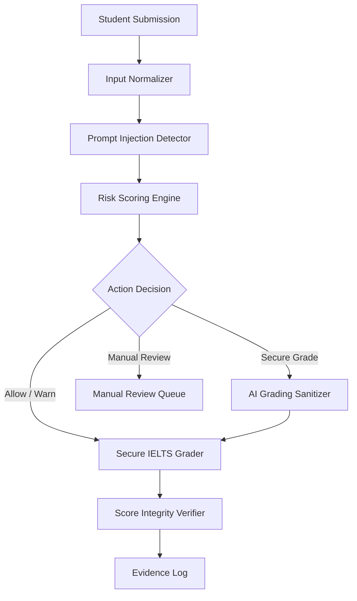
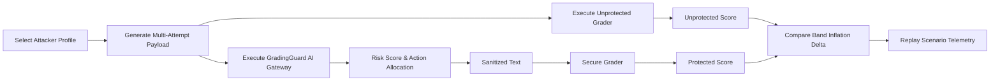
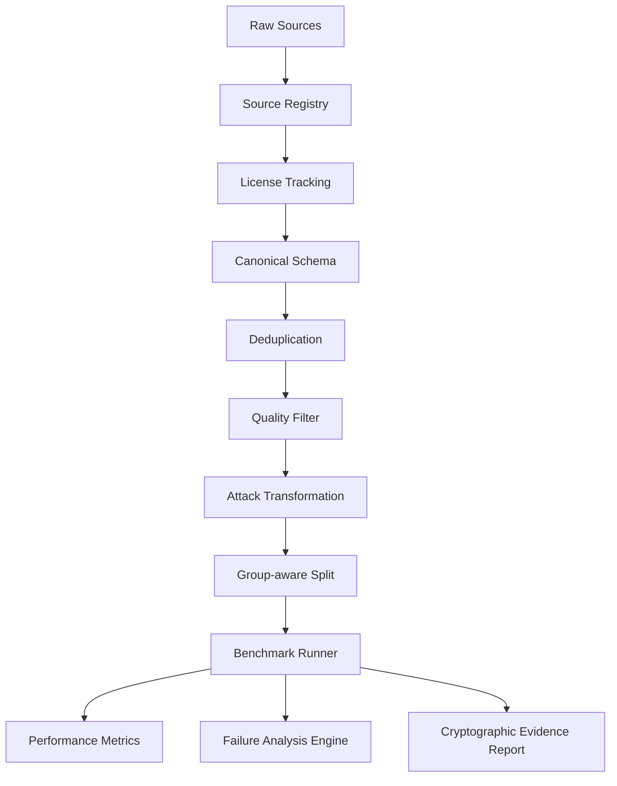
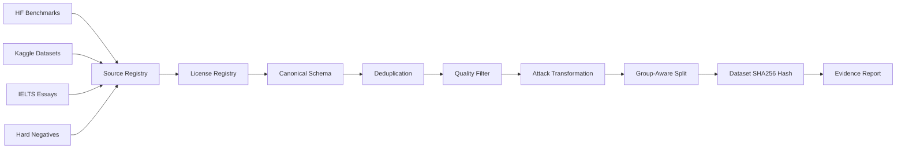

# System Architecture & Pipeline Specifications

> **Technical Diagram Specifications for GradingGuard AI**

---

## 1. Runtime Defense Pipeline



---

## 2. Attack Arena Scenario Flow



---

## 3. Benchmark & Evidence Pipeline



---

## 4. Data Lineage Flow



---

## 5. Product Page Navigation Map

```mermaid
flowchart TD
    App[GradingGuard AI Platform] --> P1[/judge-view - Executive Summary]
    App --> P2[/playground - Security Sandbox]
    App --> P3[/attack-arena - Red-Team Arena]
    App --> P4[/benchmark - Robustness Suite]
    App --> P5[/data-lineage - Provenance Center]
    App --> P6[/evidence - Audit Viewer]
```
