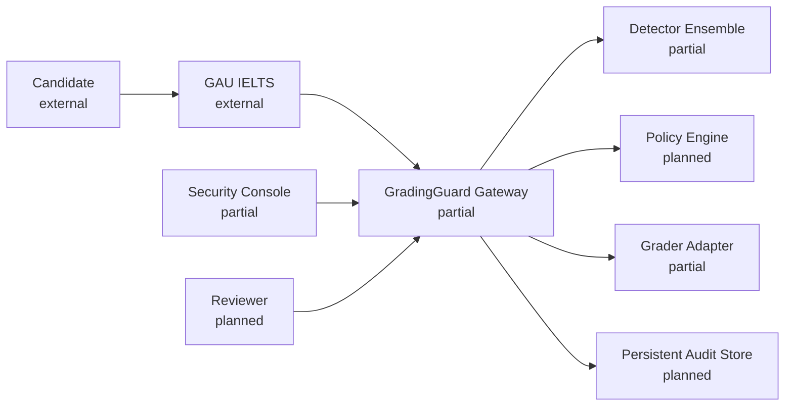
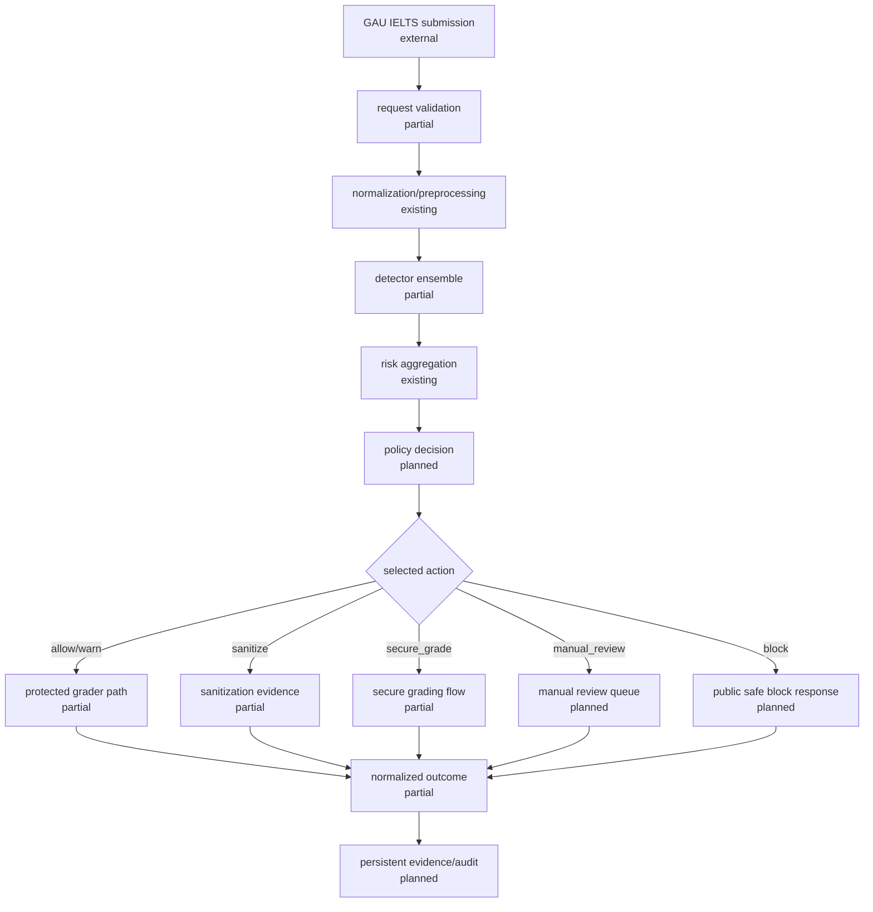
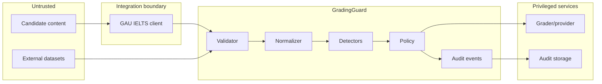
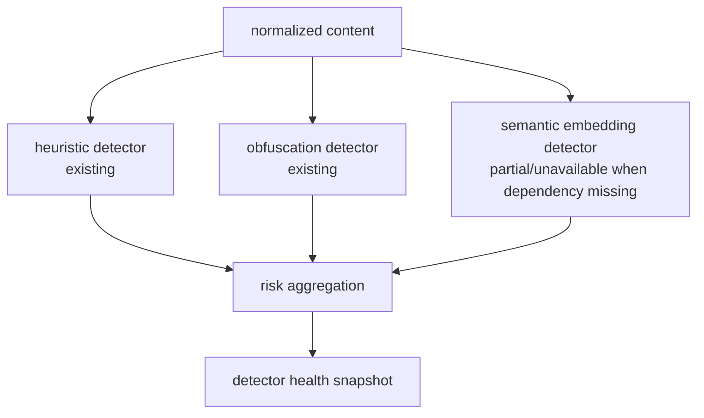
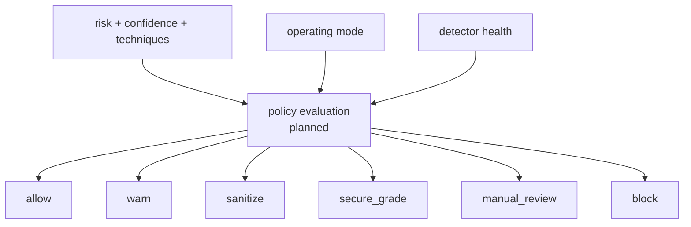
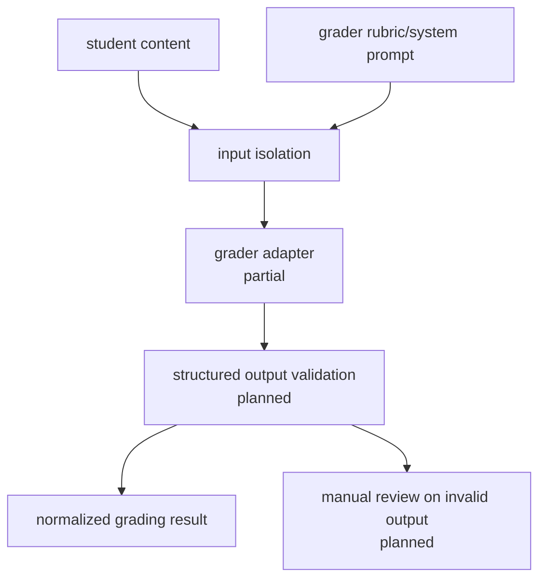
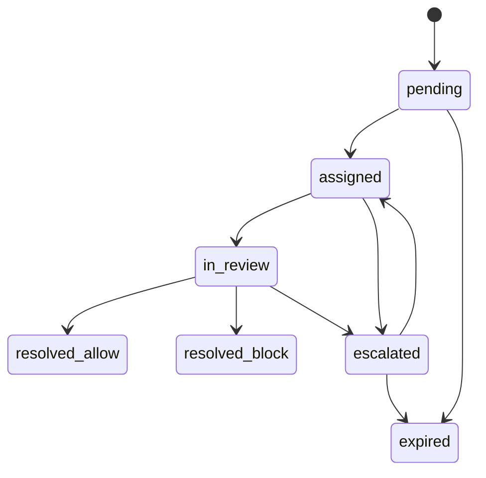
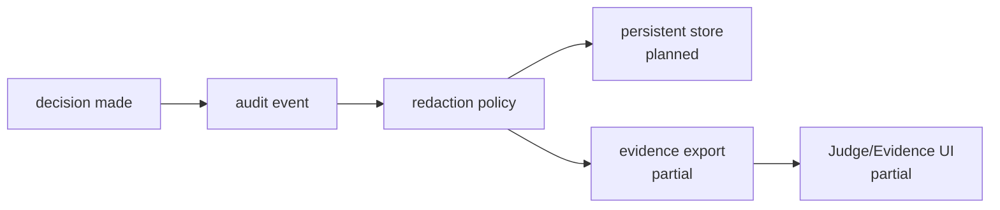
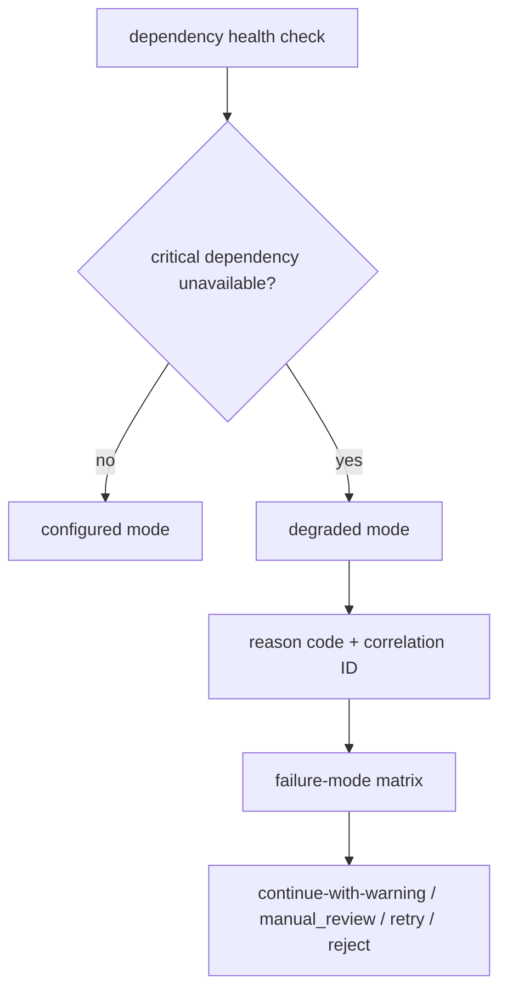
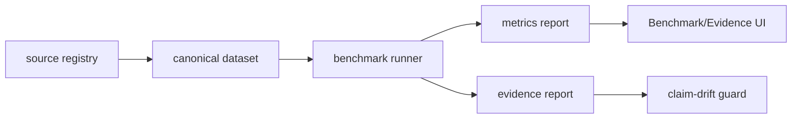

# GradingGuard Architecture

Status labels used below:

- `existing`: present in current repository.
- `partial`: present but incomplete or demo-only.
- `planned`: contracted for later phases.
- `external`: outside this repository.

## 1. High-level system context

## 2. Request decision flow

## 3. Trust boundaries

## 4. Detector ensemble

## 5. Policy routing

## 6. Secure grading flow

## 7. Manual review lifecycle

## 8. Evidence and audit flow

## 9. Degraded-mode flow

## 10. Benchmark/evidence pipeline

## Runtime path boundaries

- Synchronous path: request validation -> normalization -> detectors -> risk aggregation -> policy/action -> grader/review/block -> public response.
- Asynchronous path: audit persistence, review assignment, evidence export, health telemetry.
- Benchmark-only path: dataset runner, evidence reports, failure analysis.
- Demo-only path: deterministic mock grading and attack arena.
- Future capability: persistent audit, real policy store, RBAC, production grader adapter, manual review backend.

