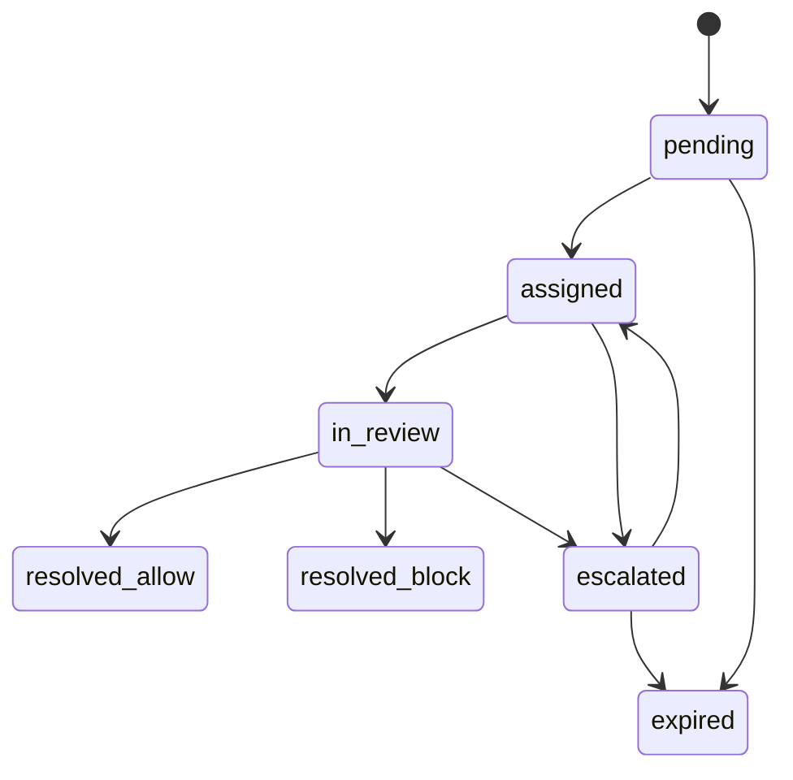

# Manual Review Workflow Contract

Status: Phase 1 contract

## State machine

States: `pending`, `assigned`, `in_review`, `resolved_allow`, `resolved_block`, `escalated`, `expired`.

## Required fields

- Priority.
- SLA deadline.
- Assignee.
- Reviewer notes.
- Resolution.
- Version.
- Optimistic lock token.
- Conflict reason.
- Reassignment reason.
- Escalation reason.
- Audit trail.
- Permissions.

## Semantics

- `pending`: created by policy decision.
- `assigned`: reviewer owns the item.
- `in_review`: reviewer has opened or locked the item.
- `resolved_allow`: reviewer permits grading/continuation.
- `resolved_block`: reviewer blocks or rejects the submission.
- `escalated`: requires senior analyst/admin.
- `expired`: SLA or queue lifetime exceeded.

## Prohibited behavior

- Silent overwrite.
- One-click destructive resolution without confirmation.
- Resolution without audit.
- Exposing raw sensitive input by default.
- Mutating a closed review without a new correction event.

